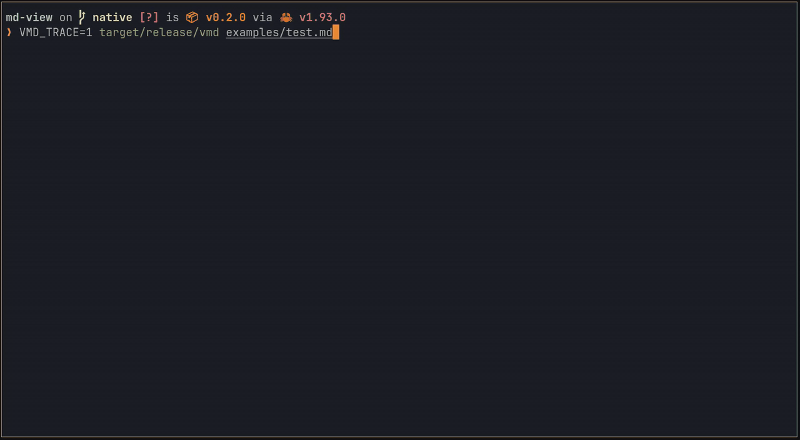

# view md

A fast, native markdown viewer for Linux, macOS, and Windows. 

Renders rich layout and syntax highlighting in a single 120 Hz frame (<8.3 ms).

Vim/vimium-style keybinds: `y` yanks code blocks, `f` opens links, `/` searches. 

Light and dark themes.

Built for a terminal + browser workflow.



## Why

Inspired by the raw speed of [tofi](https://github.com/philj56/tofi), a launcher that can open in a single frame.

Quickly jump in and out of markdown files to check their contents: README.md, SKILL.md, PLAN.md...

"I" created this tool to make it as seamless and painless as possible.

## Here be AI

For your own sanity, do not read the source code. All planning docs and messy git history included for full transparency. This repository does not represent my personal code standards.

## Build

    cargo build --release
    # symlink target/release/vmd to ~/.local/bin
    # installs .desktop metadata entry
    ./install.sh

## Use

```sh
vmd file.md
vmd 'file.md#section' # open at anchor
vmd -                 # read from stdin
vmd --licenses        # print vmd's license + bundled fonts + all third-party deps
vmd --trace           # print timing breakdown
vmd --watch file.md   # watches file for changes and live updates
```

`?` to show keybinds.

`f` to interact.

`/` to search.

`q` to quit.

`+` to scale up.

`-` to scale down.

`0` to reset scale.

## License

vmd is dual-licensed under MIT or Apache-2.0; see `LICENSE-MIT` and
`LICENSE-APACHE`. Run `vmd --licenses` (or read `THIRD-PARTY-LICENSES.md`)
for the full text of every embedded dependency.

To regenerate `THIRD-PARTY-LICENSES.md` after a `cargo update` or new dep:

    cargo install cargo-about --features cli   # one-time
    cargo about generate about.hbs > THIRD-PARTY-LICENSES.md

## Bundled Fonts

vmd embeds the following fonts to skip fontconfig at startup. Both are under
the SIL Open Font License 1.1. See `vmd --licenses` or the files in `assets/`
for the full text.

- Inter (Regular, Bold, Italic, BoldItalic). © 2016 The Inter Project Authors. https://github.com/rsms/inter
- JetBrains Mono (Regular, Bold, Italic). © 2020 JetBrains s.r.o. https://github.com/JetBrains/JetBrainsMono

## How it Stays Fast

Measured on a Ryzen 9 9800X3D, Wayland/SwayWM, against `examples/test.md`. Numbers scale with doc size. 

A typical README cold-launches inside one 120 Hz frame (<8.3 ms exec → present), with one caveat: if there are code blocks in the initial visible frame the launch waits for syntect to finish computing highlights to avoid a redraw. Worst case, this delays launch by one extra frame (~5 ms).

- Bundled fonts, zero-copy. Seven TTFs via `include_bytes!`, handed to
  `fontdb` as `Source::Binary(Arc<…>)` — no per-`FontSystem` copy of
  ~400 KB × 7 faces. Skips fontconfig (50 to 150 ms with ~10k fonts
  installed)
- mimalloc as global allocator. Shaping and layout churn through small
  allocations; mimalloc handles them noticeably faster than the system
  allocator
- CPU raster, not GPU. `softbuffer` + `tiny-skia` into wl_shm. Skips
  ~50 to 150 ms of wgpu/NVIDIA driver init that webviews and GPU
  renderers pay on cold launch
- Parse, then everything else in parallel. `pulldown-cmark` parses
  synchronously (microseconds). After that, three pools spin up:
    - Speculative layout + shape on a background thread
    - Pre-warm the swash glyph cache for the visible viewport
    - `syntect` highlight, bounded to four workers
- Wait briefly for syntect before first paint, but only if code block
  on first visible frame
- Skip the `request_redraw` round-trip
- Glyph raster via `swash.get_image()`
- Memoize highlights by `(lang, code, theme)`
- Active theme only at startup
